# Security Automation Lab

A complete, multi-stage security automation toolkit covering concurrent port scanning, structured nmap XML parsing, SSH enrichment, authentication log mining, web log anomaly detection, and integrated multi-stage reconnaissance — all built with Python stdlib and subprocess calls to standard Kali tools.

---

## Repository Structure

```
├── scanner.py              # Part 1: concurrent port scanner
├── parse_scan.py           # Part 2: nmap XML parser and enricher
├── auth_analysis.py        # Part 3: SSH auth log brute-force detector
├── log_analysis.py         # Part 3: web access log attack detector
├── recon.py                # Part 4: integrated multi-stage reconnaissance tool
├── sample_output/
│   ├── results.json        # recon.py output — duolingo.com (domain) + 8.8.8.8 (IP)
│   ├── report.md           # report markdown
│   └── audit.log           # timestamped audit trail of all recon actions
├── assets/                 # screenshots of each part's execution
└── README.md
```

---

## Requirements

- **OS**: Kali Linux (or any Debian-based Linux with standard tools)
- **Python**: 3.10+
- **System tools**: `nmap`, `whois`, `dnsutils` (dig), `curl`, `openssh-client`

### Installation

```bash
# Update and install all required system tools
sudo apt-get update
sudo apt-get install -y nmap whois dnsutils curl openssh-client

# Clone the repository
git clone https://github.com/DASarria/SPTI-AUTOMATION.git
cd SPTI-AUTOMATION

```

---

## Part 1 — Concurrent Port Scanner (`scanner.py`)

Benchmarks three scanning strategies — sequential, threading, and asyncio — against the same target to demonstrate the performance impact of I/O concurrency.

### What it does

| Mode | Mechanism | Best for |
|------|-----------|----------|
| `seq` | Single-threaded TCP connect loop | Baseline reference |
| `thread` | `ThreadPoolExecutor` with configurable workers | Moderate concurrency (50–500) |
| `async` | `asyncio` + `asyncio.Semaphore` | High concurrency with rate control |

### Usage

```bash
# Sequential baseline
python3 scanner.py 127.0.0.1 --mode seq --ports 1-1024

# Threaded scan — compare different worker counts
python3 scanner.py 127.0.0.1 --mode thread --rate 50  --ports 1-1024
python3 scanner.py 127.0.0.1 --mode thread --rate 200 --ports 1-1024
python3 scanner.py 127.0.0.1 --mode thread --rate 500 --ports 1-1024

# Asyncio scan with high concurrency
python3 scanner.py 127.0.0.1 --mode async --rate 200 --ports 1-1024 --output results.json
```

### CLI Reference

| Flag | Description | Default |
|------|-------------|---------|
| `target` | IP address to scan | *(required)* |
| `--mode` | `seq`, `thread`, or `async` | `async` |
| `--ports` | Range (`1-1024`) or list (`22,80,443`) | `1-1024` |
| `--rate` | Max concurrent connections | `200` |
| `--timeout` | Per-port timeout in seconds | `0.5` |
| `--output` | JSON output file | stdout |

### Sample Output (JSON)

```json
{
  "target": "127.0.0.1",
  "scan_time_seconds": 0.076,
  "timestamp": "2026-05-11T18:40:18.090377Z",
  "open_ports": [22, 80],
  "scan_mode": "async",
  "rate_limit": 200
}
```

### Part 1 Screenshots

**Sequential baseline — recording elapsed time:**

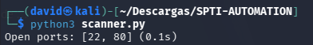

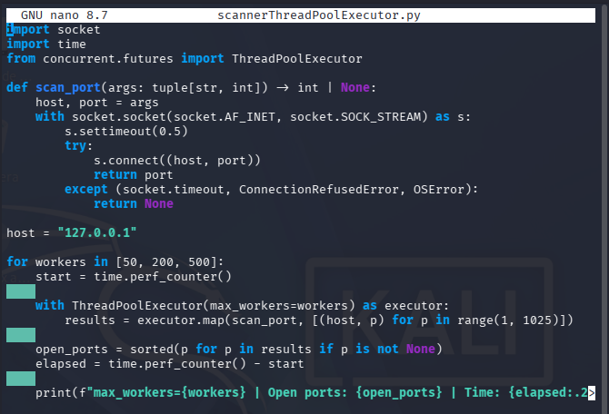

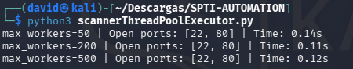

**Threaded scan — performance comparison across worker counts:**

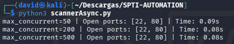

**Asyncio scan — high-concurrency with Semaphore:**

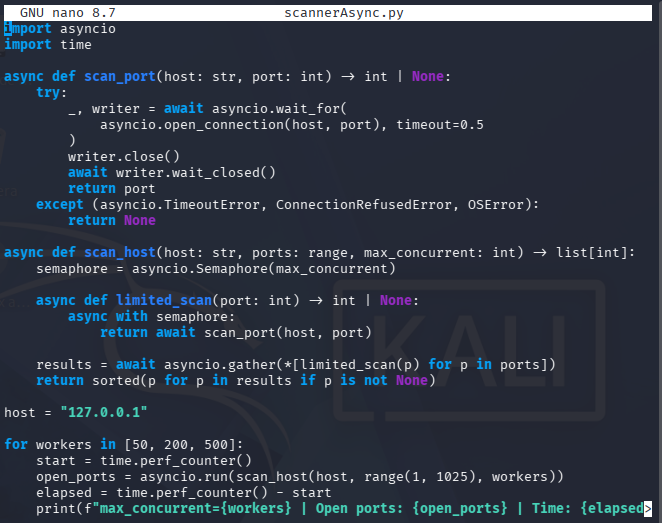

**Final concurrent scanner result:**

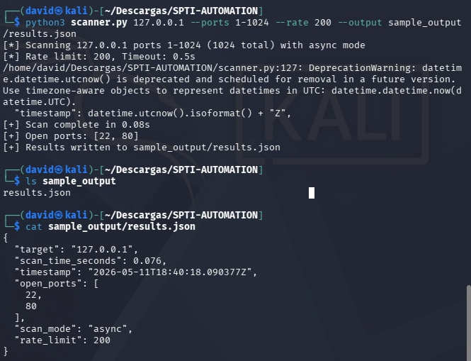


### Question

> *At `--rate 2000` you may observe open ports reported as closed. Explain the mechanism.*

At very high concurrency the OS exhausts its file descriptor limit and connection-backlog queue on the **scanner side**, causing `connect()` to return `OSError` or timeout before the target ever responds. The target port was open and would have replied — but the scanner's own resource constraints prevented the probe from completing. Additionally, the target's kernel TCP backlog may fill under burst load, causing SYN packets to be silently dropped.


---

## Part 2 — Structured output and enrichment

Parses the structured XML output of `nmap -sV` and enriches each host that has port 22 open with its SSH host key type via `ssh-keyscan`.

### Usage

```bash
# Step 1 — generate nmap XML
nmap -sV --open -oX scan.xml 192.168.1.0/24

# Step 2 — parse and enrich
python3 parse_scan.py --input scan.xml --output hosts.json

# Skip SSH key scanning
python3 parse_scan.py --input scan.xml --output hosts.json --no-ssh
```

### Sample Output (JSON)

```json
[
  {
    "ip": "192.168.1.10",
    "hostname": "gateway.local",
    "open_ports": [
      {"port": 22, "service": "ssh", "version": "", "product": "OpenSSH"},
      {"port": 80, "service": "http", "version": "", "product": "Apache httpd"}
    ],
    "ssh_host_key_type": "ecdsa-sha2-nistp256"
  }
]
```

### Part 2 Screenshots

**nmap XML structure inspection before writing code:**

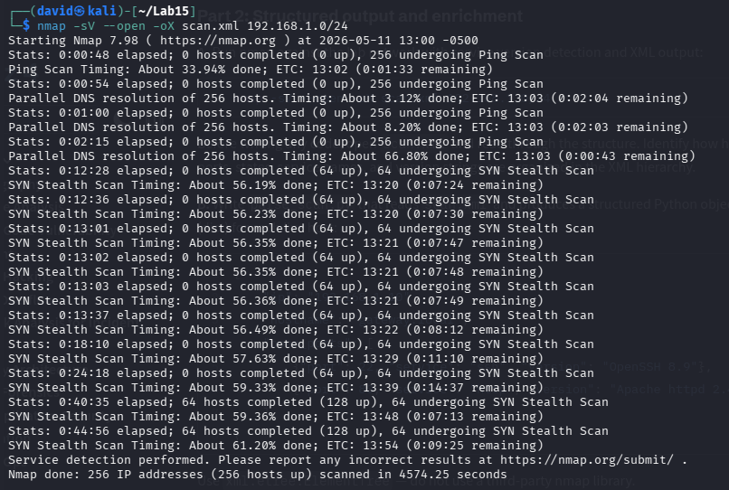

**Parsed JSON output from parse_scan.py:**

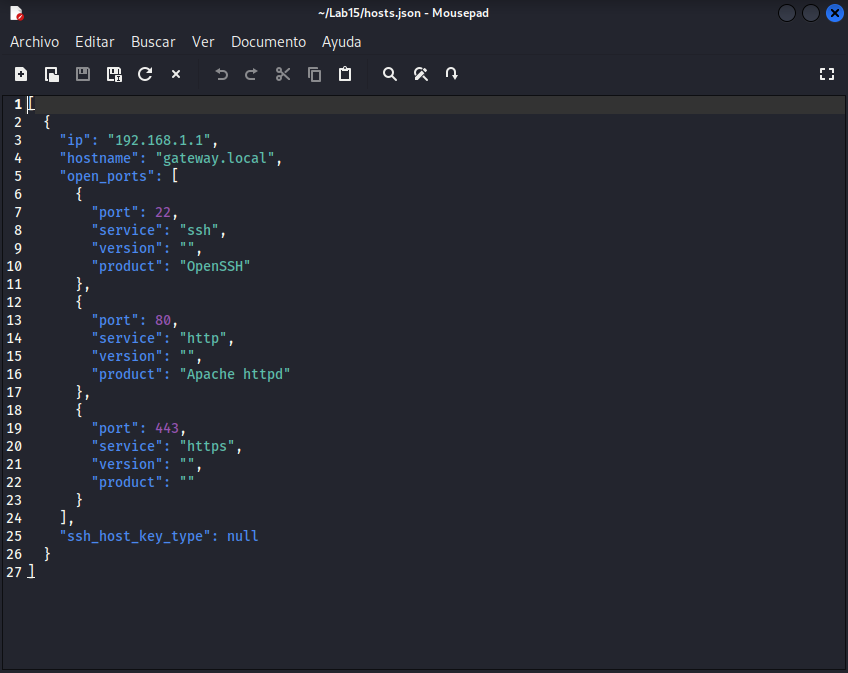

**Final enriched output:**

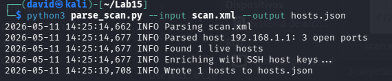

### Design Rationale

- `xml.etree.ElementTree` (stdlib) is used instead of a third-party nmap library to keep zero external dependencies and to demonstrate that the XML format is simple enough to parse directly.
- Each host is parsed independently; a malformed host element causes a `continue`, not a crash.
- `ssh-keyscan` runs with `subprocess.run(..., timeout=timeout+2)` — the inner timeout is passed to `ssh-keyscan` itself (`-T`), and the outer Python timeout is a hard backstop so one hung host cannot block the pipeline.
- `FileNotFoundError` is caught separately to give a clear error if `openssh-clients` is not installed.

### Lab Question — Service Version Strings and Attacker Value

> *Why is the version string in a service banner valuable intelligence for an attacker?*

A version string like `Apache httpd 2.4.54` immediately maps to a **specific CVE list**. The attacker can query the NVD, ExploitDB, or Metasploit module list for that exact version, skip manual fingerprinting, and go straight to a weaponized exploit. It converts a generic "web server" into a targeted attack surface.

A server returning **no version string** forces the attacker to:
1. Probe behavior manually to infer the version.
2. Run nmap's full service-probe database, generating more noise.
3. Attempt exploits blindly, risking detection or incompatibility.

The security-relevant difference is the **cost of exploitation**: version disclosure trades reconnaissance time for attacker convenience. Removing headers (`ServerTokens Prod` in Apache, `server_tokens off` in nginx) does not fix the underlying vulnerability — but it raises the bar and delays automated scanners.

---

## Part 3 — Log Analysis and anomaly detection

Two complementary log analyzers: one for SSH authentication logs, one for HTTP access logs with statistical anomaly detection.

---

### Authentication Analysis

Detects brute-force SSH login attempts by counting failed login events per source IP and targeted username.

#### Usage

```bash
# Analyze an existing auth log
python3 auth_analysis.py --input auth.log

# With custom threshold and JSON output
python3 auth_analysis.py --input auth.log --threshold 10 --output auth_report.json
```


#### Results 

**Brute Force IPs detected:**

| IP | Failed Attempts |
|----|----------------|
| 185.220.101.5 | 259 |
| 45.33.32.156 | 202 |
| 10.0.0.1 | 18 |
| 10.0.0.2 | 14 |

**Most targeted accounts:**

| User | Attempts |
|------|----------|
| root | 131 |
| daniel | 128 |
| admin | 124 |
| ubuntu | 117 |

- **Total failed logins:** 500
- **Total successful logins:** 20
- **Fail/success ratio:** 0.962

#### Screenshot

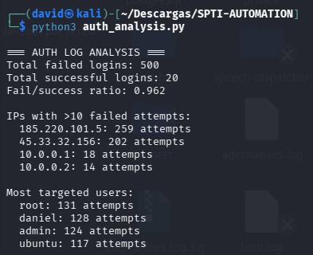

---

### Log analysis and Anomaly Detection 

Detects web attack patterns (SQLi, path traversal, XSS, command injection) and identifies anomalous traffic.

#### Usage

```bash
# Analyze access log with default settings
python3 log_analysis.py --input access.log

# Custom sigma threshold and JSON output
python3 log_analysis.py --input access.log --sigma 3.0 --output web_report.json
```


#### Attack Patterns Detected

The regex engine covers:
- **SQL Injection**: `union.*select`, `insert.*into`, `delete.*from`, `drop table`
- **Path Traversal**: `../`, `..\`, `..%2f`
- **XSS**: `<script`, `javascript:`, `onerror`, `onload`
- **Command Injection**: `cmd=`, `exec=`, `shell=`, `system(`
- **Reconnaissance probes**: `/wp-admin`, `/phpmyadmin`, `/admin`

#### Results

- **Total requests parsed:** 3,168
- **Attack patterns detected:** 127

**Top 5 IPs by request volume:**

| IP | Requests |
|----|----------|
| 10.0.0.1 | 1,835 |
| 66.249.66.1 | 591 |
| 185.220.101.5 | 294 |
| 45.33.32.156 | 278 |
| 192.168.1.50 | 170 |

**HTTP Status Code Distribution:**

| Status | Count |
|--------|-------|
| 200 | 3,084 |
| 403 | 42 |
| 500 | 42 |

**3-Sigma Anomaly Detection — Anomalous Hours:**

| Hour | Requests | Z-Score | Mean | StDev |
|------|----------|---------|------|-------|
| 11/May/2026-03 | 944 | **4.68σ** | 132 | 173.4 |

```
[ANOMALY] 11/May/2026-03 — 944 requests (z=4.68σ, threshold=3.0σ)
```

#### Screenshot

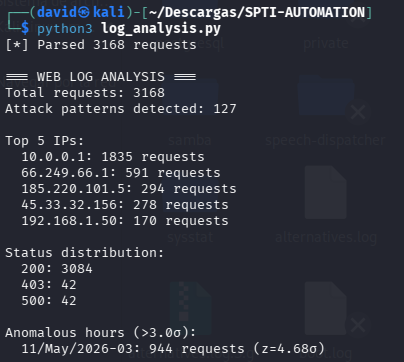


### Question — 3-Sigma and Daily Traffic Periodicity

> *Web traffic has strong daily periodicity. How does this affect the single global baseline?*


Using a global mean and standard deviation introduces two problems:
false positives during off-peak hours (where even moderately elevated 
traffic exceeds the threshold) and false negatives during peak hours 
(where significantly elevated traffic still falls within the global 
normal range). A more robust approach would be to build per-hour baselines: instead 
of one global mean, compute a separate mean and standard deviation for 
each hour of the day across multiple days of historical data.

---

## Part 4 — Integrated Reconnaissance Tool (`recon.py`)

A single-command multi-stage reconnaissance tool that auto-detects whether the target is a domain or IP, runs all relevant recon steps independently, writes a structured `results.json`, a human-readable `report.md`, and a timestamped `audit.log`.

### Usage

```bash
# Domain reconnaissance (auto-detected)
python3 recon.py duolingo.com --verbose

# IP reconnaissance (auto-detected)
python3 recon.py 8.8.8.8 --verbose

# Explicit mode with custom output directory
python3 recon.py example.com --mode domain --output ./recon_example --verbose
```

### CLI Reference

| Flag | Description | Default |
|------|-------------|---------|
| `target` | Domain name or IP address | *(required)* |
| `--mode` | `domain`, `ip`, or `auto` | `auto` |
| `--output` | Output directory | `./sample_output` |
| `--verbose` | Print progress to stderr | off |

### Output Files

| File | Description |
|------|-------------|
| `results.json` | All findings as structured JSON, keyed by tool |
| `report.md` | Auto-generated human-readable markdown report |
| `audit.log` | Timestamped record of every action taken |

### Domain Mode — Steps Executed

1. `whois <target>` — extracts registrar, registrant organization
2. `dig <target> A/MX/NS/TXT +short` — queries all DNS record types
3. `curl -I -L http://<target>` — extracts HTTP response headers
4. `curl -I -L https://<target>` — extracts HTTPS response headers

### IP Mode — Steps Executed

1. `nmap -sV --open --top-ports 100 -oX <file> <target>` — scans top 100 ports, parses XML output
2. `dig -x <target> +short` — reverse DNS lookup
3. `whois <target>` — extracts organization and country

### Sample Run — duolingo.com (domain mode)

```
[+] Reconnaissance complete
[+] Output directory: sample_output
[+] Results: sample_output/results.json
[+] Report:  sample_output/report.md
[+] Audit log: sample_output/audit.log
```

**WHOIS result:**
- Registrar: Amazon Registrar, Inc.
- Registrant: Identity Protection Service

**DNS A Records:** `35.153.234.88`, `98.89.254.120`, `54.205.107.150`, `54.167.143.88`

**DNS NS Records:** AWS Route 53 nameservers (`ns-1020.awsdns-63.net`, etc.)

**Security Header Audit (HTTP/HTTPS):**

| Header | HTTP | HTTPS |
|--------|------|-------|
| Content-Security-Policy | ❌ MISSING | ❌ MISSING |
| Strict-Transport-Security | ❌ MISSING | ❌ MISSING |
| X-Frame-Options | ✅ SAMEORIGIN | ✅ SAMEORIGIN |
| X-Content-Type-Options | ❌ MISSING | ❌ MISSING |

### Sample Run — 8.8.8.8 (IP mode)

**Open ports detected by nmap:**

| Port | Service |
|------|---------|
| 53 | tcpwrapped |
| 443 | tcpwrapped |

### Part 4 Screenshots

**Domain mode — duolingo.com:**

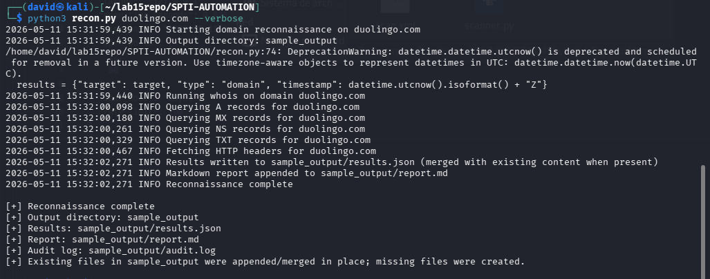

**IP mode — 8.8.8.8:**

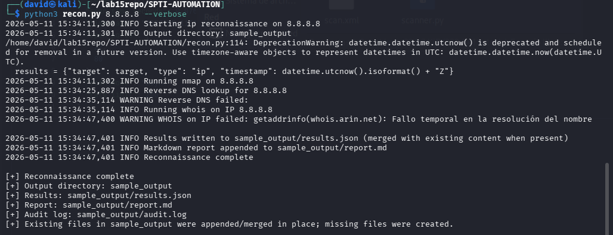

### Audit Log (actual run)

```
2026-05-11 15:31:59 INFO  Starting domain reconnaissance on duolingo.com
2026-05-11 15:31:59 INFO  Running whois on domain duolingo.com
2026-05-11 15:32:00 INFO  Querying A records for duolingo.com
2026-05-11 15:32:00 INFO  Querying MX records for duolingo.com
2026-05-11 15:32:00 INFO  Querying NS records for duolingo.com
2026-05-11 15:32:00 INFO  Querying TXT records for duolingo.com
2026-05-11 15:32:00 INFO  Fetching HTTP headers for duolingo.com
2026-05-11 15:32:02 INFO  Results written to sample_output/results.json
2026-05-11 15:32:02 INFO  Markdown report appended to sample_output/report.md
2026-05-11 15:32:02 INFO  Reconnaissance complete
2026-05-11 15:34:11 INFO  Starting ip reconnaissance on 8.8.8.8
2026-05-11 15:34:11 INFO  Running nmap on 8.8.8.8
2026-05-11 15:34:25 INFO  Reverse DNS lookup for 8.8.8.8
2026-05-11 15:34:35 WARNING Reverse DNS failed
2026-05-11 15:34:35 INFO  Running whois on IP 8.8.8.8
2026-05-11 15:34:47 WARNING WHOIS on IP failed: temporary DNS resolution failure
2026-05-11 15:34:47 INFO  Results written to sample_output/results.json
2026-05-11 15:34:47 INFO  Reconnaissance complete
```

### Design Rationale

- **`ReconAuditor` class** wraps the Python `logging` module and writes to both stderr and `audit.log` simultaneously — a `FileHandler` is added at construction time.
- **Each step runs in a `try/except` via `run_cmd()`** which catches `TimeoutExpired`, `FileNotFoundError`, and generic `Exception`, returning a tuple `(returncode, stdout, stderr)`. A failure in any one step returns an error dict and logs a warning, but execution continues to the next step.
- **`results.json` is merged, not overwritten** — if the file exists and is valid JSON, the new run's results are appended to a `part4_runs` list. This allows running the tool multiple times without losing previous results.
- **Auto-detection** via `socket.inet_aton()` gives a clean UX — users don't need to specify `--mode` for common cases.

### Lab Question — Active vs. Passive Reconnaissance

> *What are the operational differences between active recon (this tool) and passive recon (Shodan)?*

**Active reconnaissance** (this tool, nmap, dig, curl):
- Sends packets directly to the target — every probe appears in the target's firewall logs, IDS alerts, and netflow records.
- A defender with network monitoring **will** see the scan: SYN bursts, unusual `User-Agent` strings, DNS queries all leave artifacts.
- Required for: authorized penetration tests, confirming live state of a target's services.
- Appropriate when: you have written authorization and want current, real-time service state.

**Passive reconnaissance** (Shodan, Censys):
- Queries a third-party database that has **already scanned the internet**. Zero packets are sent to the target.
- The target cannot detect the query — it appears in Shodan's logs only, which the target cannot access.
- Appropriate when: pre-engagement intel gathering, threat intelligence research, or when stealth is a priority (e.g., red team initial recon phase).
- Limitation: data may be days or weeks stale; newly opened or closed ports won't appear immediately.

**From a defender's perspective**: Active scans are detectable via SYN-rate anomalies, IDS signatures, and firewall log analysis. Passive Shodan queries are **virtually undetectable** — there is no network artifact on the target. This makes passive recon the preferred first step for stealthy adversaries and the reason defenders should proactively query Shodan for their own assets.

---

**Author**: David Sarria — David Villadiego

